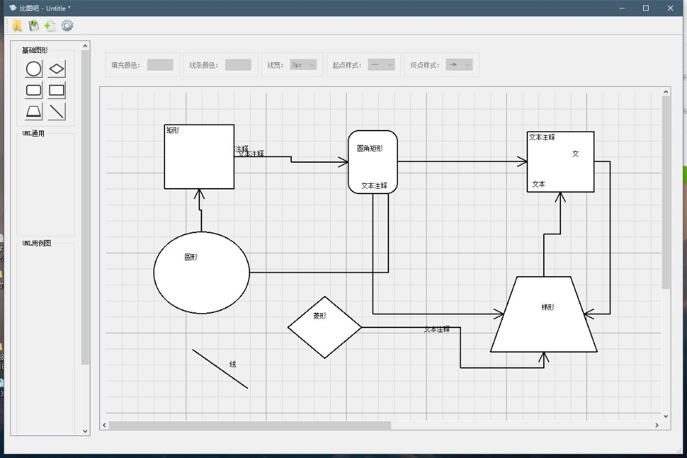

# FlowChartTool
Flow Chart Tool，使用QT开发的跨平台（Windows、Linux）流程图绘制工具

## 说明
- 本软件是一个课程的作业，如有Bug请轻喷

## 开发环境
- 操作系统：使用了Windows 10 和 Ubuntu 16
- 编译工具：使用了`QT Creator 4.7.1`可视化IDE和`QT 5.11.2`开发库

## 源码编译程序
1. Pull此工程到本地
2. 安装QT环境，QT下载地址：[http://download.qt.io/archive/qt/](http://download.qt.io/archive/qt/)，勾选相应的编译器

3. 使用QT打开FlowChartTools文件夹下的FlowChartTools.pro工程文件
4. 配置环境，Windows10下配置MSVC2017编译器，Ubuntu16下配置MinGW编译器，Ubuntu16如下，Win10同理

5. 编译、调试、运行

## 程序界面和演示

## 程序详细文档
- 详见./doc目录
